

Jag går på en Front End -utbildning på Medieinstitutet och vi har hittills lärt oss HTML och CSS. Det här projektet är en individuell inlämningsuppgift vi fick av vår lärare Jenni, där vi ska göra en webshop, med fokus på JavaScript, som vi håller på att lära oss medan vi gör uppgiften, så jag kunde ingen JavaScript alls innan dess. På fyra veckor önskar jag att jag kunde hinna mer, men som nybörjare är detta en bra början. 
sidan är responsiv och jag har tänkt på tillgänglighet.
 
Allting ska finnas i samma HTML-fil: säljsida, varukorg och kassa. Jag valde att sälja badankor i min webshop. 
Sidan finns live här: https://medieinstitutet.github.io/fed23d-js-grundkurs-webshop-Carinalak/

Dessa tekniker använder jag:  
Vanilla JavaScript  
HTML  
CSS  
SASS  

Dessa program:  
Visual Studio Code  
Figma  
Photoshop  

Jag har delat upp scss -filerna i mobil och tablet-version, samt en scss-fil för endast navigationsmenyn där både mobil, tablet och desktop-version till menyn finns, där finns en hamburgermeny som inte är aktiverad, kundkorgsikon samt sorteringsknappar.

JavaScript-filerna finns i två moduler, ducks.mjs där jag har listan på alla produkter, och script.mjs där resten finns. Jag har delat av script.mjs med kommentarer, så att det blir enklare att hitta i koden.

Jag har använt Photoshop till att beskära alla bilder så att de har samma storlek och proportioner.

Jag gjorde wireframes för mobilversionen i Figma. Dessa är bara ett exempel, så jag kan se hur jag vill ha det på ett ungefär. Slutresultatet blir inte exakt samma, eftersom jag ändrade mig hur jag ville ha det under arbetets gång:

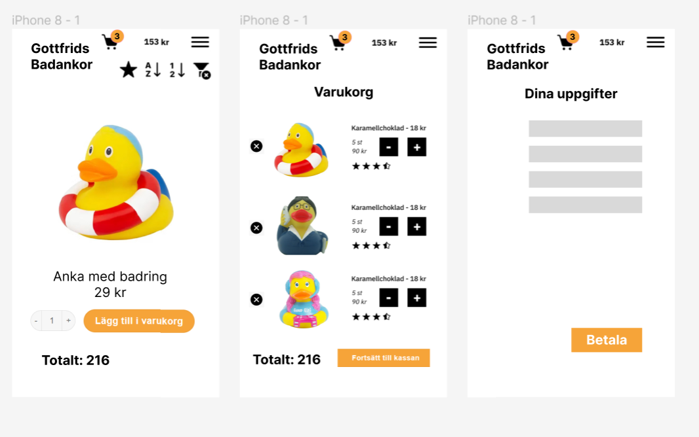

Såhär ser webshopen ut i desktop-versionen:
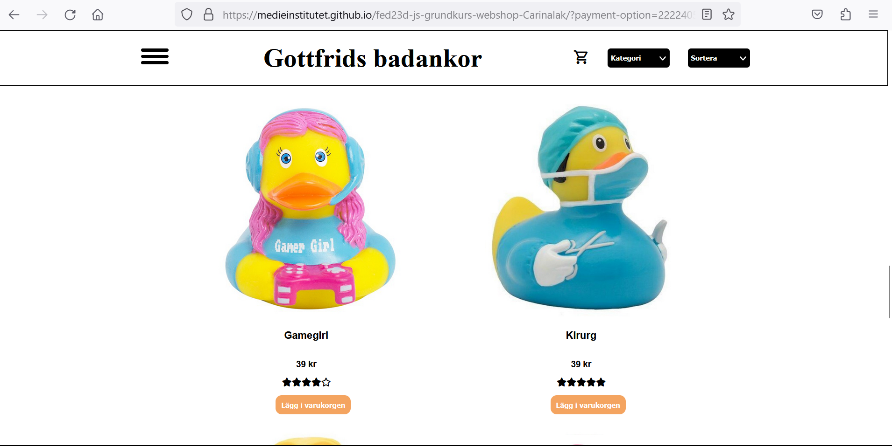

Såhär ser varukorgen ut när det är varor i den:
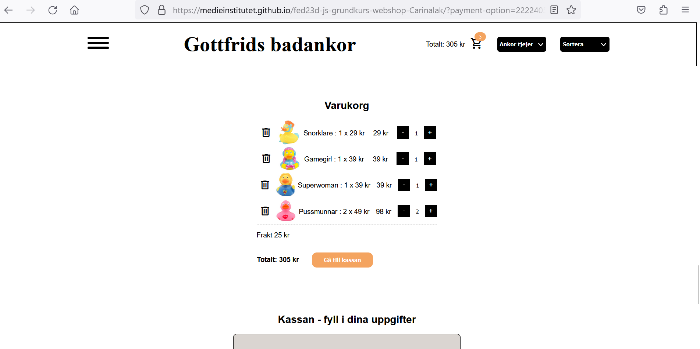

Formuläret:
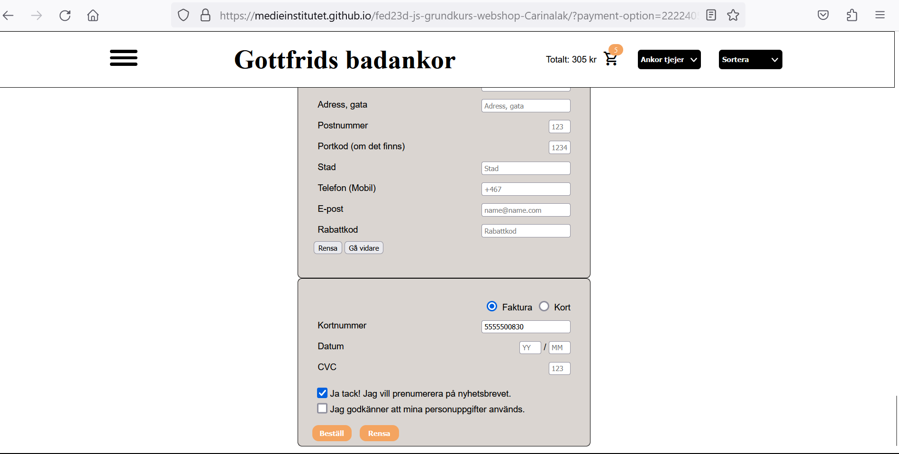

Såhär ser webshopen ut i mobil-versionen:
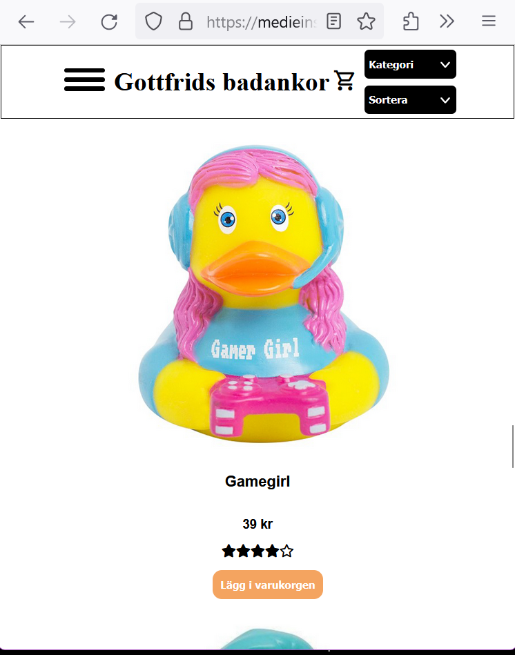
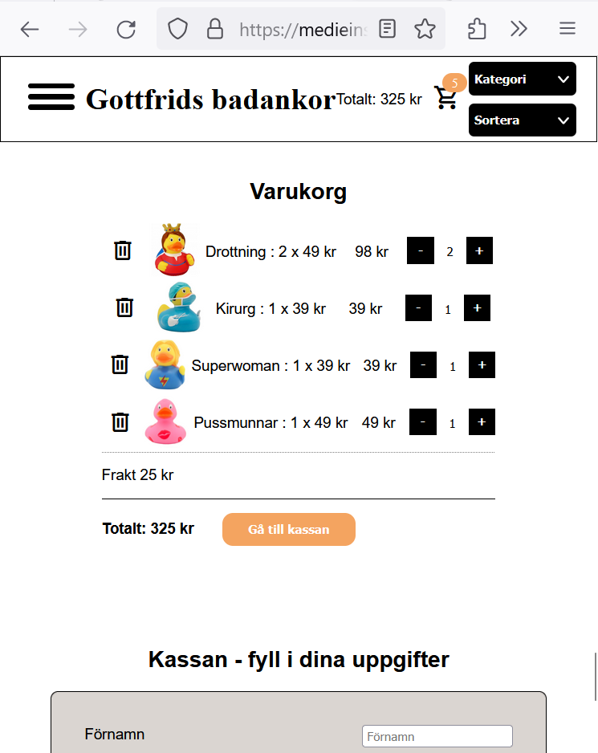
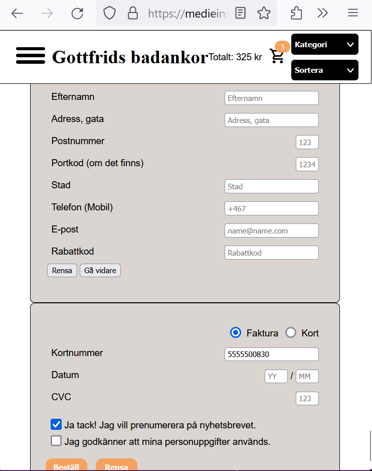

Webshopen är validerad och nedan kan du se skärmdumpar:

Validerad HTML:
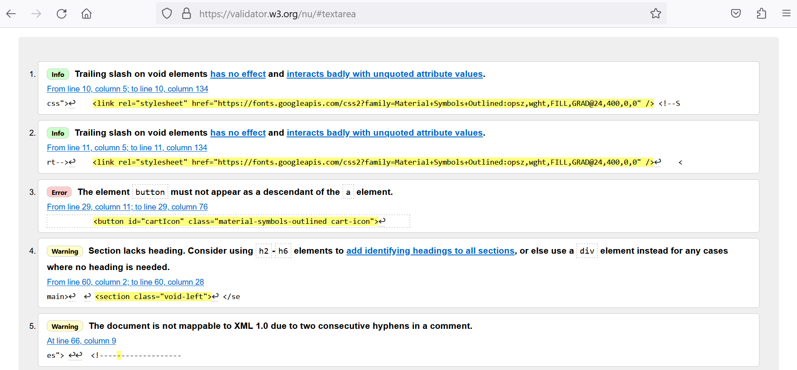
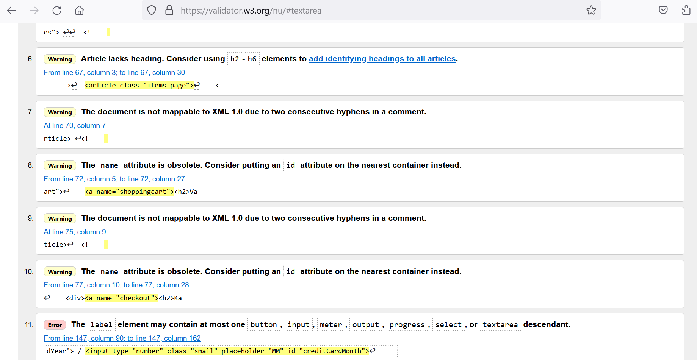
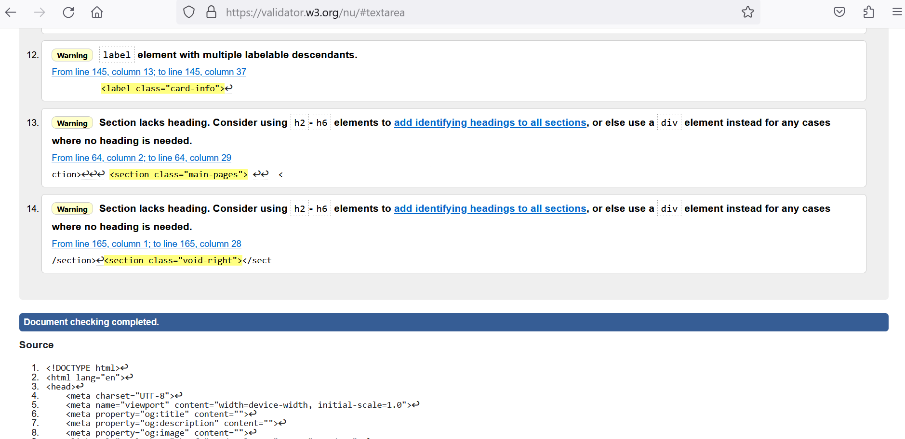

Validerad CSS:
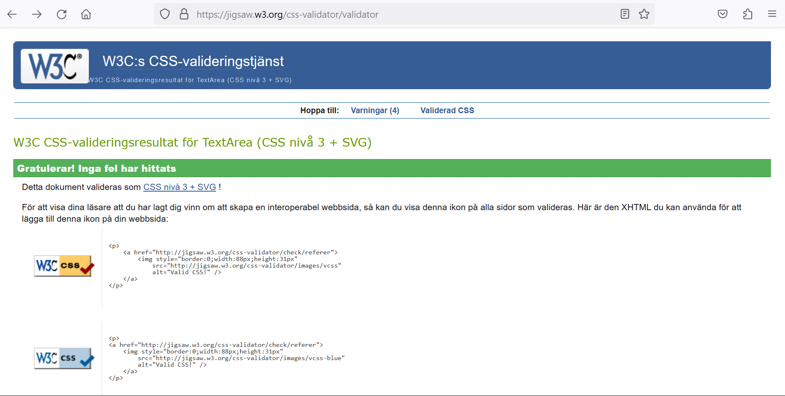

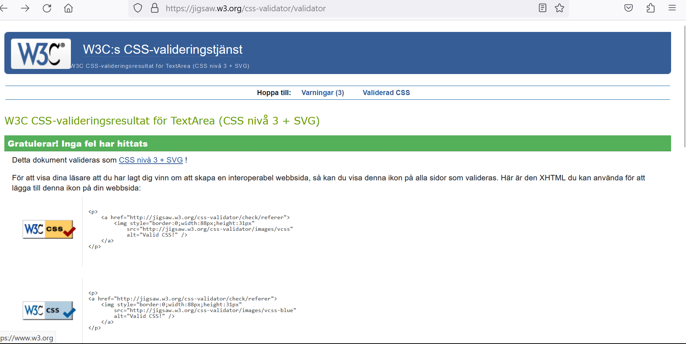
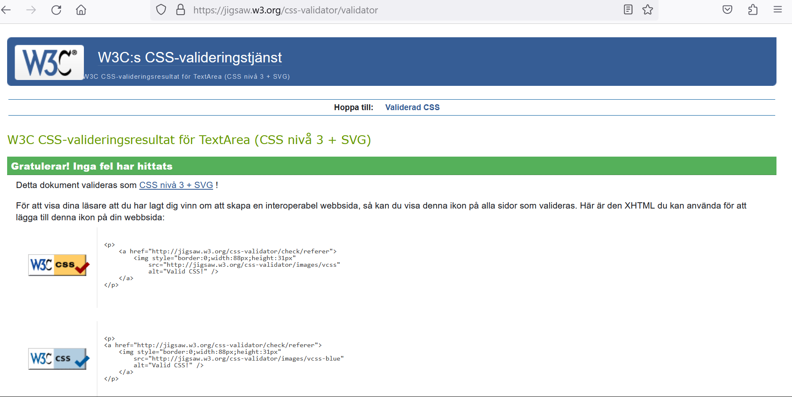

Lighthouse-analys:
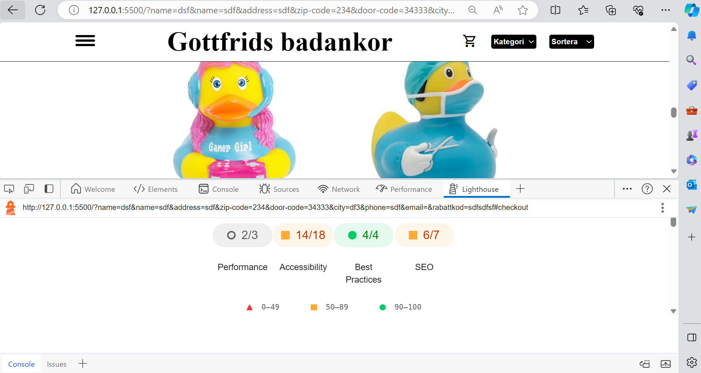