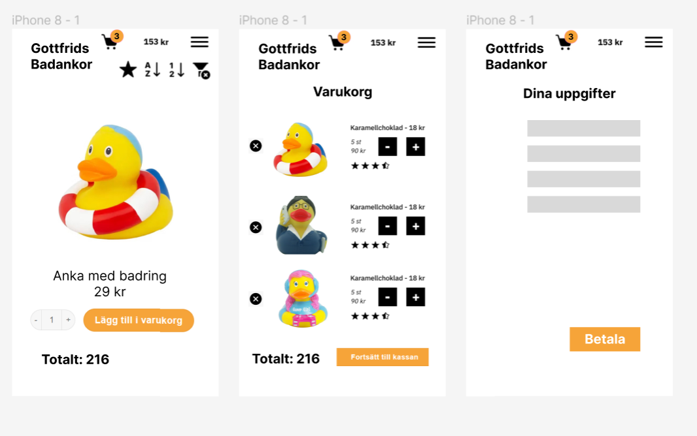

Jag går på en Front End -utbildning på Medieinstitutet och vi har hittills lärt oss HTML och CSS. Det här projektet är en individuell inlämningsuppgift vi fick av vår lärare Jenni, där vi ska göra en webshop, med fokus på JavaScript, som vi håller på att lära oss medan vi gör uppgiften, så jag kunde ingen JavaScript alls innan dess. På fyra veckor önskar jag att jag kunde hinna mer, men som nybörjare är detta en bra början. 
 
Allting ska finnas i samma HTML-fil: säljsida, varukorg och kassa. Jag valde att sälja badankor i min webshop. 
Sidan finns live här: https://medieinstitutet.github.io/fed23d-js-grundkurs-webshop-Carinalak/

Dessa tekniker använder jag:
Vanilla JavaScript
HTML 
CSS
SCSS

Dessa program:
Visual Studio Code - Jag trivs med den!
Figma - Tycker om den.
Photoshop - Jag älskar Photoshop!

Jag har delat upp scss -filerna i desktop och tablet-version, samt en scss-fil för endast navigationsmenyn, där jag har en hamburgermeny som inte är aktiverad, kundgorgsikon samt sorteringsknappar.

JavaScript-filerna finns i två moduler, ducks.mjs där jag har listan på alla produkter, och script.mjs där resten finns. Jag har delat av script.mjs med ordentliga kommentarer, så att det blir enklare att hitta i koden.

Jag har använt Photoshop till att beskära alla bilder så att de har samma storlek och proportioner.

Jag gjorde wireframes i Figma. Dessa är bara ett exempel, så jag kan se hur jag vill ha det på ett ungefär. Slutresultatet blir inte exakt samma, eftersom jag ändrade mig hur jag ville ha det under arbetets gång. För mobilversionen:

Såhär ser min webshop ut i min dator, en skärmdump:

Webshopen är validerad och nedan kan du se skärmdumpar: